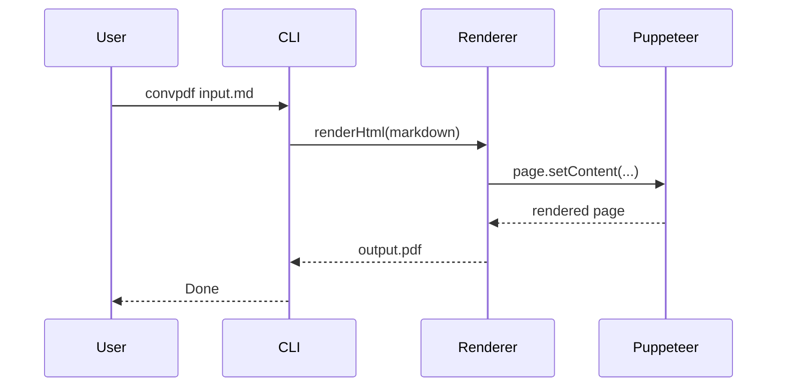

# Mermaid Diagrams

This document consolidates Mermaid coverage into one file.

## Flowchart


## Sequence Diagram



## Notes

- Mermaid fences are rendered as diagrams by default.
- Use `--no-mermaid` to disable diagram rendering.

## Try It

```bash
convpdf examples/mermaid-diagrams.md -o examples/mermaid-diagrams.pdf
```
