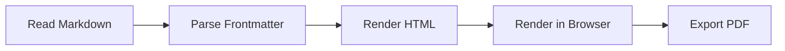

# Mermaid Flowchart

This example demonstrates a simple document rendering pipeline.

## Notes

- Mermaid fences are rendered as diagrams by default.
- Use `--no-mermaid` to disable diagram rendering.
