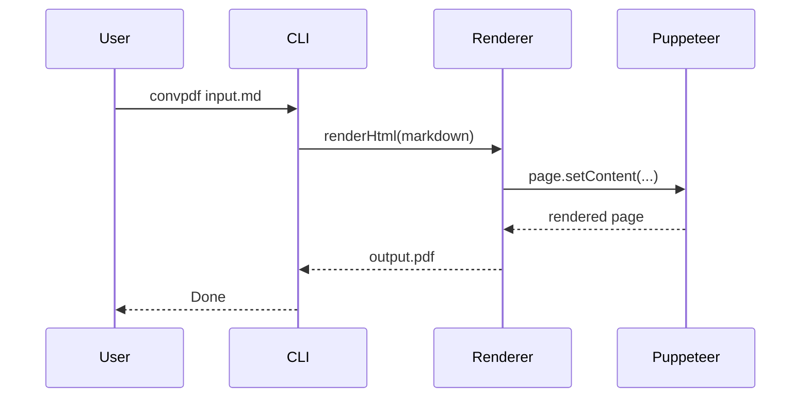

# Mermaid Sequence Diagram

This example shows interactions between the CLI, renderer, and browser.


```mermaid
sequenceDiagram
  participant U as User
  participant C as CLI
  participant R as Renderer
  participant P as Puppeteer

  U->>C: convpdf input.md
  C->>R: renderHtml(markdown)
  R->>P: page.setContent(...)
  P-->>R: rendered page
  R-->>C: output.pdf
  C-->>U: Done
```

## Try it

```bash
convpdf examples/mermaid-sequence.md -o examples/mermaid-sequence.pdf
```
