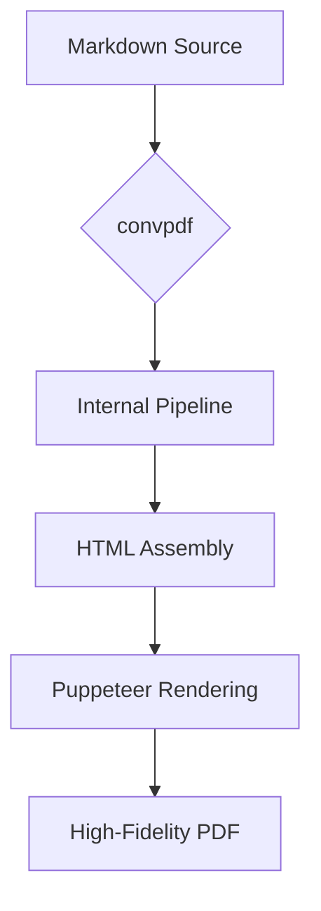

# Showcase: convpdf Features

Welcome to the **Pro Showcase**. This document demonstrates the advanced capabilities of `convpdf`, using a custom configuration, professional styling, and modern web technologies.

## Professional Typography

We use a clean, modern font stack with precise control over headers, spacing, and readability.

> "PDF generation should not be a compromise. It should be a direct reflection of your design intent."

### Data Presentation

Tables are styled with a professional aesthetic, including header highlights and alternating row colors.

| Feature | Supported | Description |
| :--- | :---: | :--- |
| Table of Contents | ✅ | Automatic generation from headers |
| MathJax | ✅ | High-quality LaTeX rendering |
| Mermaid | ✅ | Diagrams and charts via script injection |
| Custom Templates | ✅ | Full control over the HTML wrapper |
| Header/Footer | ✅ | PDF-native headers and footers |

## Mathematical Equations

`convpdf` leverages MathJax for beautiful mathematical typesetting, supporting both inline expressions and complex display blocks.

### Field Theory & Physics

The interaction between matter and light is described by **Maxwell's Equations**, which can be expressed in differential form as:

$$
\begin{aligned}
\nabla \cdot \mathbf{E} &= \frac{\rho}{\varepsilon_0} \\
\nabla \cdot \mathbf{B} &= 0 \\
\nabla \times \mathbf{E} &= -\frac{\partial \mathbf{B}}{\partial t} \\
\nabla \times \mathbf{B} &= \mu_0\mathbf{J} + \mu_0\varepsilon_0\frac{\partial \mathbf{E}}{\partial t}
\end{aligned}
$$

### Mathematical Analysis

Testing the limits of typesetting with complex fractions and integrals:

The value of the Gaussian integral $\int_{-\infty}^{\infty} e^{-x^2} dx = \sqrt{\pi}$ is fundamental to probability theory. More complex relationships, such as the **Riemann Zeta Function**, showcase symbol depth:

$$
\zeta(s) = \sum_{n=1}^{\infty} \frac{1}{n^s} = \prod_{p \text{ prime}} \frac{1}{1 - p^{-s}}, \quad \text{Re}(s) > 1
$$

And the beautiful **Euler's Identity**:

$$ e^{i\pi} + 1 = 0 $$

## Technical Diagrams

With Mermaid.js support, you can embed diagrams directly in your markdown.



## Advanced Styling

We can use custom HTML classes if needed, although raw HTML in Markdown should be used sparingly.

<div class="alert alert-info">
  <strong>Pro Tip:</strong> You can use <code>.convpdfrc.yml</code> to share common styles and templates across all your documents in a project.
</div>

## Code Highlighting

Syntax highlighting is preserved and styled to match the overall theme.

```typescript
import { Renderer } from 'convpdf';

const renderer = new Renderer({
  toc: true,
  math: true,
  mermaid: true
});

await renderer.generatePdf('# Hello World', 'output.pdf');
```

## Conclusion

This showcase demonstrates how `convpdf` bridges the gap between the simplicity of Markdown and the professional requirements of PDF documents.
